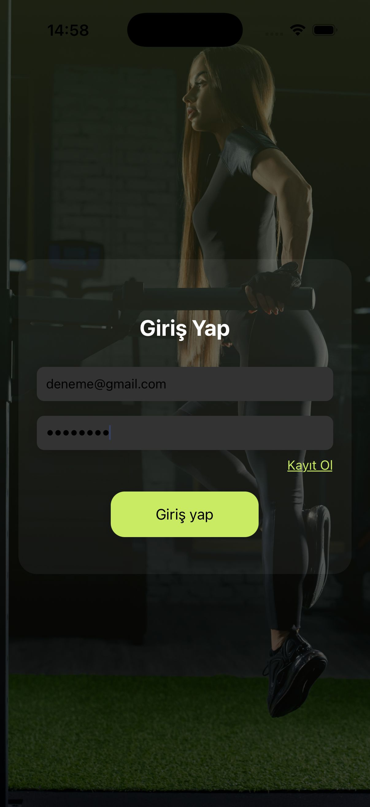
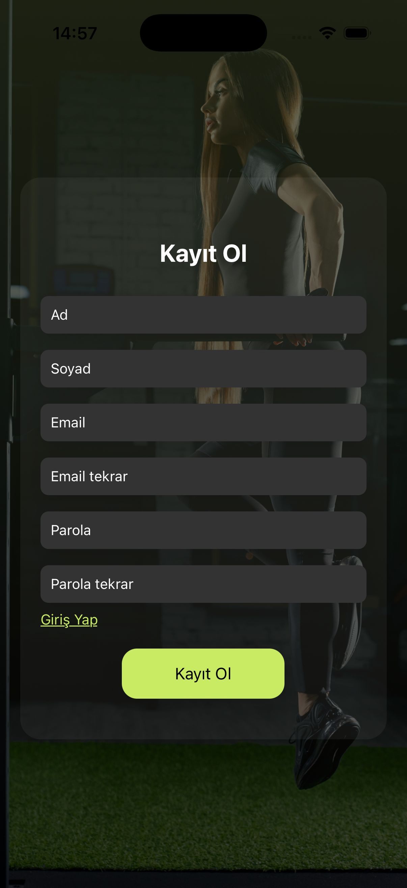
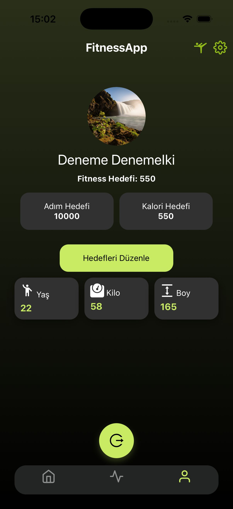
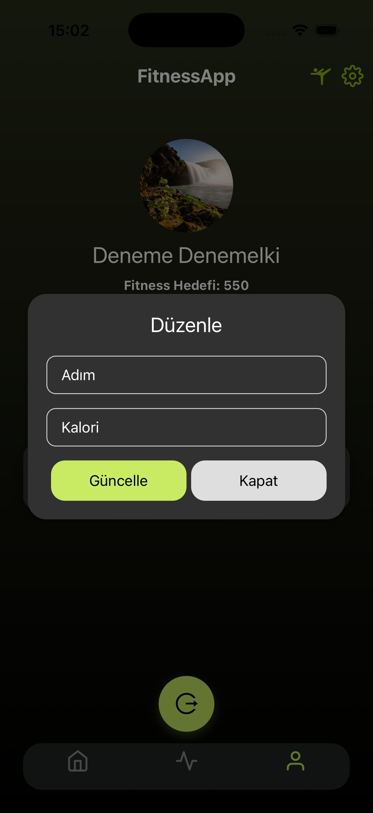
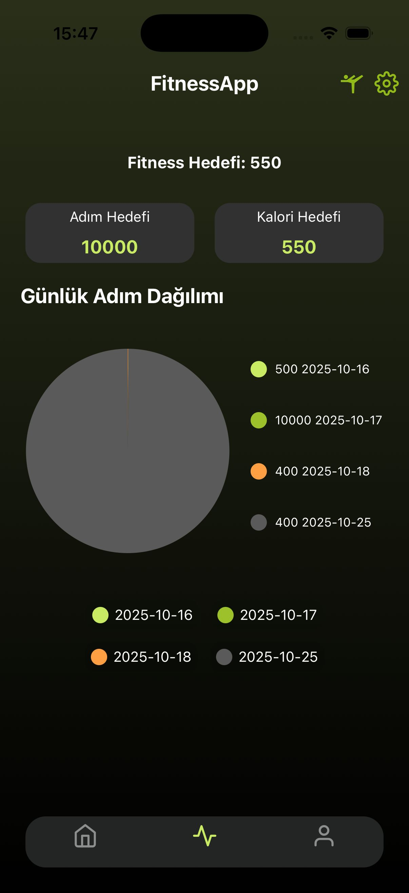
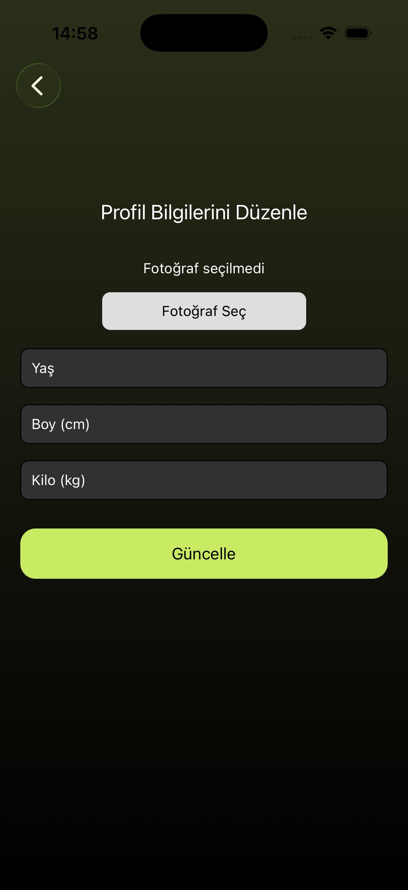
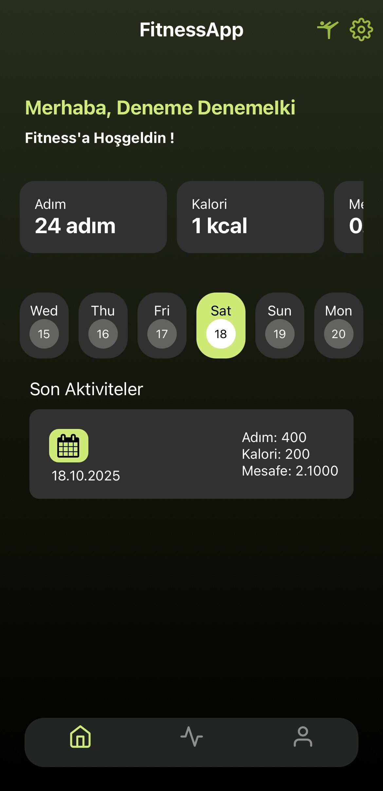
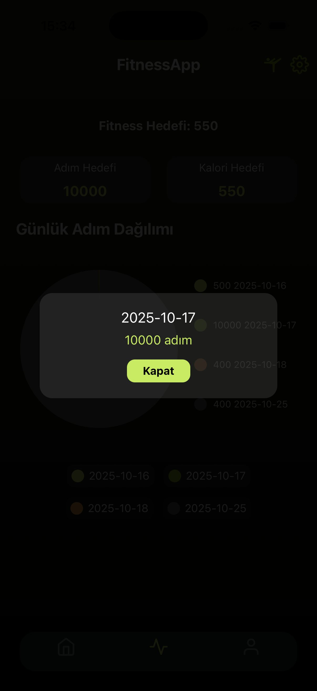

🚀 Fitness Tracker App

React Native ile geliştirdiğim bu mobil uygulama, kullanıcıların günlük aktivitelerini takip etmesini, hedefler koymasını ve ilerlemesini analiz etmesini sağlıyor.

📱 Uygulama Özellikleri:

 🔹 Firebase Authentication ile kullanıcı kayıt & giriş sistemi
 
 🔹 Profil düzenleme sayfası (yaş, kilo, boy vb. bilgiler)
 
 🔹 Günlük adım, kalori ve mesafe takibi
 
 🔹 Hedef belirleme ve ilerleme takibi
 
 🔹 PieChart ile adım & kalori analiz grafikleri
 
 🔹 Firestore veritabanı ile anlık veri kaydı
 
 🔹 Modern arayüz (LinearGradient, Tailwind ve responsive tasarım)
 
💡 React Native ile geliştirdiğim bu Fitness Tracker projesi sayesinde, Firebase entegrasyonu, veri yönetimi, state kontrolü ve UI/UX optimizasyonu konularında derinlemesine deneyim kazandım. Proje üzerinde sürekli geliştirme ve iyileştirmeler yaparak yeteneklerimi pekiştiriyorum.

## Arayüzler

  

  

  

  

  

  

  

  

