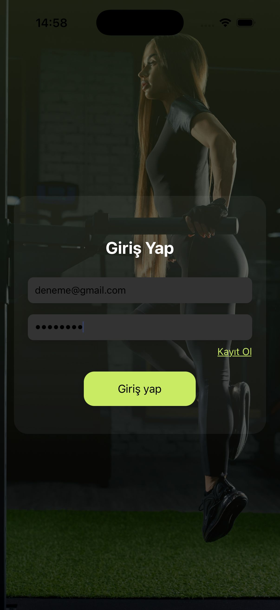
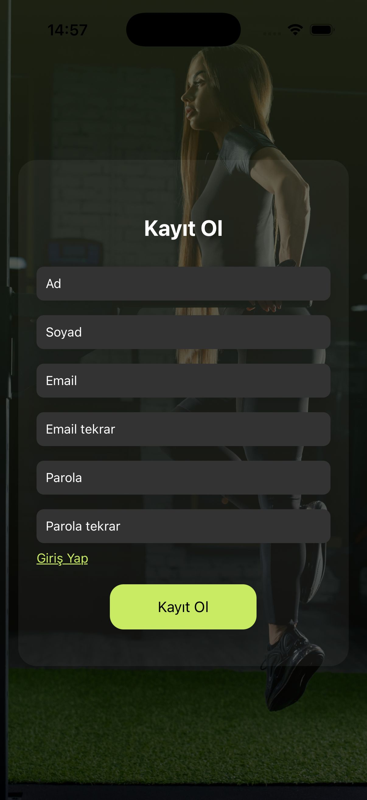
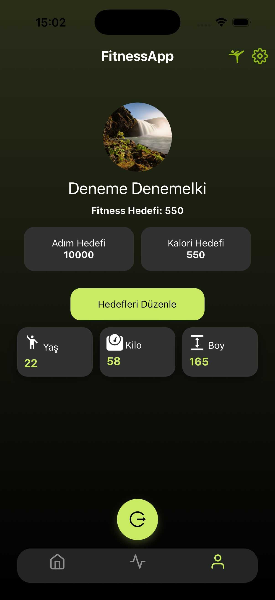
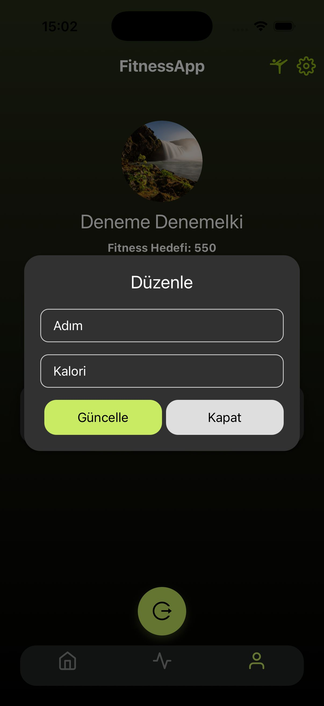
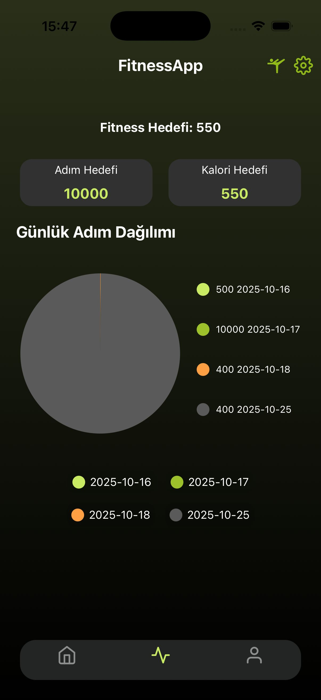
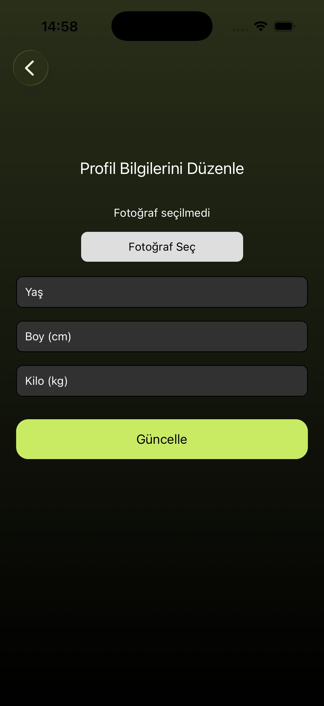
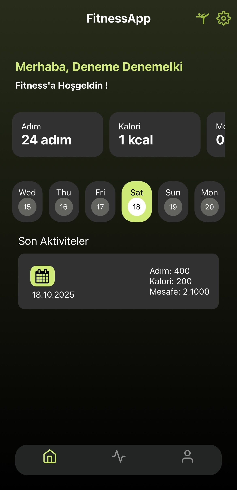
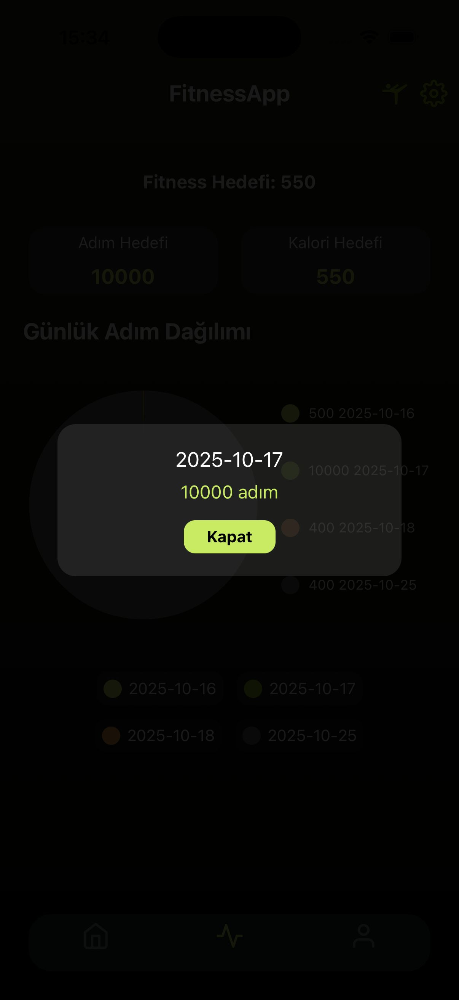

# FitnessApp

React Native ve Expo ile geliştirilmiş, günlük adım, kalori ve mesafe takibi yapan bir mobil fitness uygulaması.

## Özellikler

- Firebase Authentication ile kayıt ve giriş
- Pedometre ile günlük adım, kalori ve mesafe takibi
- Adım ve kalori hedefi belirleme
- Son 7 günün aktivite geçmişi ve gün bazlı filtreleme
- Günlük adım dağılımını gösteren pasta grafik
- Profil düzenleme (yaş, boy, kilo, fotoğraf)
- Günlük motivasyon ve hareketsizlik bildirimleri

## Kullanılan Teknolojiler

- React Native
- Expo (SDK 54)
- Firebase Authentication
- Cloud Firestore
- React Navigation
- AsyncStorage
- Expo Sensors (Pedometer)
- Expo Notifications
- Expo Image Picker
- React Native Chart Kit

## Kurulum

```bash
git clone https://github.com/zeynepbass/FitnessApp.git
cd FitnessApp
npm install
cp .env.example .env
```

`.env` dosyasına Firebase proje bilgilerini girdikten sonra uygulamayı başlat:

```bash
npm start
```

## Ekran Görüntüleri

<p align="center">
  
  
  
  
  
  
  
  
</p>

## Lisans

Bu proje [LICENCE](./LICENCE) dosyasındaki lisans ile dağıtılmaktadır.
